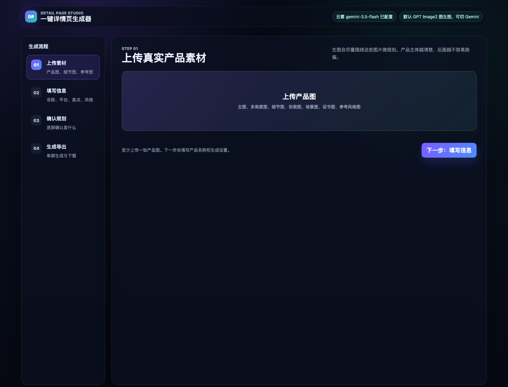
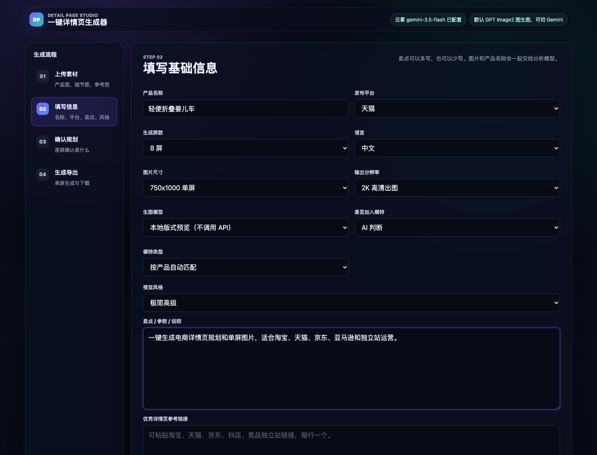
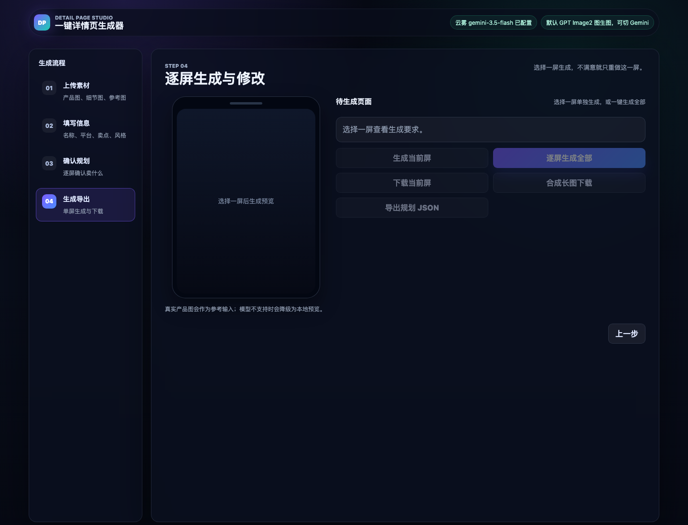
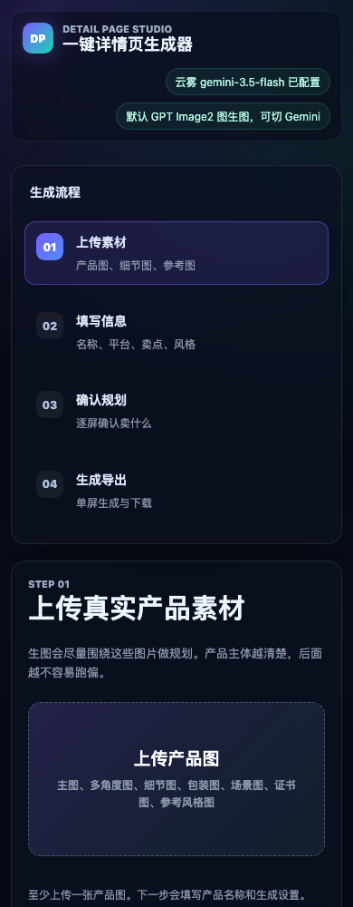

# 一键详情页生成器 Skill

这是一个 Codex Skill + 应用模板，用来搭建 AI 电商详情页生成器：上传产品图，填写平台、屏数、风格和卖点，然后生成详情页规划和单屏图片。

应用模板位置：

```text
skills/one-click-detail-page-generator/assets/detail-page-app
```

## 界面预览









## 重要说明

- 仓库不包含任何 API key。
- 公开模板只保留 `.env.example`。
- `.env`、`.env.local`、腾讯云 EdgeOne 本地状态、Vercel 本地状态都不会上传。
- 想直接使用线上部署版，或需要我帮你部署到腾讯云 EdgeOne / Vercel，可以联系仓库作者。

## Use

安装或复制这个 skill 后，可以这样调用：

```text
Use $one-click-detail-page-generator to set up the detail page generator.
```

本地没有 API key 也能用演示模式跑完整流程。真实 AI 规划和生图需要在本地 `.env.local` 或部署平台环境变量里配置自己的模型 key。

## 部署服务

如果你想要可直接访问的线上版，可以联系我部署。部署时 API key 只配置在服务器/平台环境变量里，不会进入 GitHub 仓库。

支持：

- 本地一键启动
- 腾讯云 EdgeOne Pages
- Vercel
- OpenAI-compatible 图像模型
- Gemini / OpenAI-compatible 规划模型
